# Getting Started

For your first administration backend with ng-admin, you need:

- a REST API
- a static web server (or a CDN)

Let's use the REST API offered by [JSONPlaceholder](http://jsonplaceholder.typicode.com/) for this example. You'll just serve the static files from your local host.

## Skeleton

Ng-admin is a client-side library, used to build single-page admin applications. To begin, you have to embed the ng-admin JS and CSS scripts in an HTML page, and run it in a web browser. Here is the typical HTML skeleton:

```html
<!DOCTYPE html>
<html>
    <head>
        <meta charset="utf-8">
        <title>My First Admin</title>
        <link rel="stylesheet" href="node_modules/ng-admin/build/ng-admin.min.css">
    </head>
    <body ng-app="myApp">
        <div ui-view="ng-admin"></div>
        <script src="node_modules/ng-admin/build/ng-admin.min.js" type="text/javascript"></script>
        <script src="admin.js" type="text/javascript"></script>
    </body>
</html>
```

Create a `my-first-admin/` directory, and save this HTML skeleton under the name `index.html`.

Nothing fancy here, but you notice that the page loads assets from the `node_modules/` directory. Let's use the `npm` command to install ng-admin:

```sh
cd my-first-admin
npm install ng-admin --save
```

**Tip**: For now, you will be using a version of ng-admin that packages all dependencies into a single file, including angular.js itself. When you need to package ng-admin manually with other dependencies, you can use the standalone version (see [Getting Ready For Production](Production.md)).

Now it's time to initialize the `admin.js` file, which holds the configuration of the administration application. It's quite straightforward: just require the `ng-admin` angular module, create an (empty) `admin` *application*, and let ng-admin execute it.

```js
// declare a new module called 'myApp', and make it require the `ng-admin` module as a dependency
var myApp = angular.module('myApp', ['ng-admin']);
// declare a function to run when the module bootstraps (during the 'config' phase)
myApp.config(['NgAdminConfigurationProvider', function (nga) {
    // create an admin application
    var admin = nga.application('My First Admin');
    // more configuration here later
    // ...
    // attach the admin application to the DOM and execute it
    nga.configure(admin);
}]);
```

The first two lines are typical [angular.js](https://angularjs.org/) code, and use [Angular's dependency injection system](https://docs.angularjs.org/guide/di) to inject an object called `NgAdminConfigurationProvider` to the inner function - the object is named `nga` in the function body.

There are two important things to understand here. First, the `nga` object, which you will use frequently, serves as a factory for creating objects, and for running the admin application. It is a helper provided by ng-admin. Second, an *application* is the root of the configuration for an ng-admin administration. An application holds views, datagrids, forms, and templates for the entire administration.

That's enough for the first step. You should now have the following file structure:

```
my-first-admin/
  index.html
  admin.js
  node_modules/
    ng-admin/
      build/
        ng-admin.min.css
        ng-admin.min.js
```

Now open the `index.html` file in your browser:


The header title matches the title defined on the `admin` app. You're all good!

## Adding a REST API Endpoint

Ng-admin lets you fulfill admin tasks based on remote datasources. The only prerequisite for this to work is that the remote datasource must implement the (loosely standardized) [REST format](https://en.wikipedia.org/wiki/Representational_state_transfer), which is the most common format for APIs.

JSONPlaceholder provides such a REST API. For instance, here is the response to the [`GET /users` HTTP request](http://jsonplaceholder.typicode.com/users) on this service:

```
HTTP/1.1 200 OK
Content-Length:5645
Content-Type:application/json; charset=utf-8
[
  {
    "id": 1,
    "name": "Leanne Graham",
    "username": "Bret",
    "email": "Sincere@april.biz",
    "address": {
      "street": "Kulas Light",
      "suite": "Apt. 556",
      "city": "Gwenborough",
      "zipcode": "92998-3874",
      "geo": {
        "lat": "-37.3159",
        "lng": "81.1496"
      }
    },
    "phone": "1-770-736-8031 x56442",
    "website": "hildegard.org",
    "company": {
      "name": "Romaguera-Crona",
      "catchPhrase": "Multi-layered client-server neural-net",
      "bs": "harness real-time e-markets"
    }
  },
  {
    "id": 2,
    "name": "Ervin Howell",
    "username": "Antonette",
    "email": "Shanna@melissa.tv",
    "address": {
      "street": "Victor Plains",
      "suite": "Suite 879",
      "city": "Wisokyburgh",
      "zipcode": "90566-7771",
      "geo": {
        "lat": "-43.9509",
        "lng": "-34.4618"
      }
    },
    "phone": "010-692-6593 x09125",
    "website": "anastasia.net",
    "company": {
      "name": "Deckow-Crist",
      "catchPhrase": "Proactive didactic contingency",
      "bs": "synergize scalable supply-chains"
    }
  },
  ...
```

Ng-admin can natively understand this syntax. Let's add a "Users" section to the admin app, mapping that `/users` endpoint. Modify the `admin.js` file as follows:

```js
var myApp = angular.module('myApp', ['ng-admin']);
myApp.config(['NgAdminConfigurationProvider', function (nga) {
    // create an admin application
    var admin = nga.application('My First Admin')
      .baseApiUrl('http://jsonplaceholder.typicode.com/'); // main API endpoint
    // create a user entity
    // the API endpoint for this entity will be 'http://jsonplaceholder.typicode.com/users/:id
    var user = nga.entity('users');
    // set the fields of the user entity list view
    user.listView().fields([
        nga.field('name'),
        nga.field('username'),
        nga.field('email')
    ]);
    // add the user entity to the admin application
    admin.addEntity(user);
    // attach the admin application to the DOM and execute it
    nga.configure(admin);
}]);
```

The new code creates a `user` JavaScript object mapping the `/users` HTTP endpoint on JSONPlaceholder. In ng-admin, the `user` object is called an "Entity", and it holds the description of the administration panel based on the `/users` endpoint. Entity objects let you specify fields, validation rules, templates, filters, etc. They are the the objects you will manipulate the most with ng-admin.

Then, the code defines the fields to appear on the `listView`. This list view is one of the five views ng-admin uses to describe CRUD (Create, Retrieve, Update, Delete) operations. Here are these views, and how they map to REST resources:

```
listView      => GET    /users    
creationView  => POST   /users    
showView      => GET    /users/:id
editionView   => PUT    /users/:id
deletionView  => DELETE /users/:id
```

You define fields on views, not on entities, in order to be able to use a different set of fields for each view (for instance, display only a subset of fields in the list, but the full set of fields in the edition view).

**Tip**: `nga.entity()`, just like `nga.application()` and `nga.field()`, is a *factory function*. Each of these functions return an instance of a given admin configuration class (`Entity`, `Application`, and `Field`).

Time to refresh the browser page to see how this new script behaves:

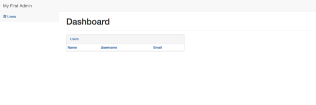

You now have a new menu item in the left sidebar matching the `user` entity (don't focus on the empty "dashboard" for now). Clicking on that menu reveals the famous users list view.


The good news is that the 3 fields defined on the list view are there, as headers of a datagrid. The bad news is that the datagrid is empty. Why is that?

## Mapping The REST API Flavor

Let's look at the AJAX request made by the user list view. Open your browser developer tools (Alt+Cmd+I for Chrome), and look for the `users` request in the network tab:

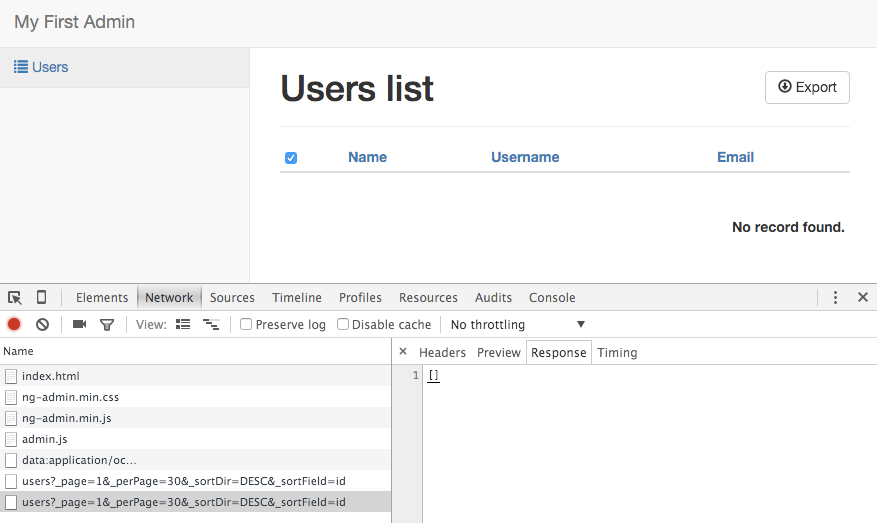

The actual request made by the browser is:

http://jsonplaceholder.typicode.com/users?_page=1&_perPage=30&_sortDir=DESC&_sortField=id

And the JSONPlaceholder response is empty:

```
[]
```

The `_page`, `_perPage`, `_sortDir`, and `_sortField` query parameters are added by ng-admin to paginate and order the list on screen. Unfortunately, the REST pattern doesn't specify how endpoints should handle pagination and ordering. JSONPlaceholder uses a different REST "flavor" than what ng-admin expects. In fact, JSONPlaceholder expects queries looking like the following:

http://jsonplaceholder.typicode.com/users?_start=1&_end=30&_order=DESC&_sort=id

But it's very easy to map the two flavors. Ng-admin relies on a powerful REST client called [Restangular](https://github.com/mgonto/restangular). To configure Restangular, you must write an *interceptor*, which is a simple function receiving the response from the web server and transforming it before it is passed to ng-admin.

Here is the configuration script required to map the JSONPlaceholder REST flavor with ng-admin REST flavor:

```js
myApp.config(['RestangularProvider', function (RestangularProvider) {
    RestangularProvider.addFullRequestInterceptor(function(element, operation, what, url, headers, params) {
        if (operation == "getList") {
            // custom pagination params
            if (params._page) {
                params._start = (params._page - 1) * params._perPage;
                params._end = params._page * params._perPage;
            }
            delete params._page;
            delete params._perPage;
            // custom sort params
            if (params._sortField) {
                params._sort = params._sortField;
                params._order = params._sortDir;
                delete params._sortField;
                delete params._sortDir;
            }
            // custom filters
            if (params._filters) {
                for (var filter in params._filters) {
                    params[filter] = params._filters[filter];
                }
                delete params._filters;
            }
        }
        return { params: params };
    });
}]);
```

Add this script to the end of the `admin.js` file, reload the users list view in the browser, and you should now see rows appear in the datagrid.

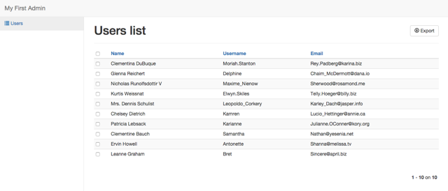

If you want to know more about how to map any API with ng-admin, go to the [API Mapping documentation](API-mapping.md).

The definition of the interceptor is usually done only once per API. Now that your ng-admin app knows how to speak with the JSONPlaceholder REST backend, every new endpoint you add will work out of the box. You can check it by adding a list view for another endpoint, `/posts`, which exposes a list of posts:

```js
var myApp = angular.module('myApp', ['ng-admin']);
myApp.config(['NgAdminConfigurationProvider', function (nga) {
    var admin = nga.application('My First Admin')
      .baseApiUrl('http://jsonplaceholder.typicode.com/'); // main API endpoint

    var user = nga.entity('users');
    user.listView().fields([
        nga.field('name'),
        nga.field('username'),
        nga.field('email')
    ]);
    admin.addEntity(user)

    var post = nga.entity('posts');
    post.listView().fields([
        nga.field('id'),
        nga.field('title'),
        nga.field('userId')
    ]);
    admin.addEntity(post);

    nga.configure(admin);
}]);
```

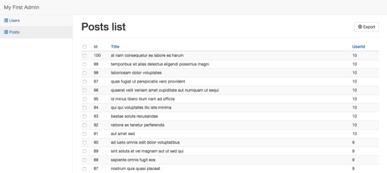

The list is ordered by id desc by default - this usually displays the latest element first. You can click on a column header to sort the list by the corresponding field. You can also use the pagination control at the bottom of the list to see the next 30 items. Finally, you can export the entire list to a CSV files with the "Export" button.

## Relationships and Field Types

The list of posts displays user ids, which is a pity since the `/users` endpoint exists. Let's use it to display the user name instead:

```js
var post = nga.entity('posts');
post.listView().fields([
    nga.field('id'),
    nga.field('title'),
    nga.field('userId', 'reference')
        .targetEntity(user)
        .targetField(nga.field('username'))
        .label('User')
]);
admin.addEntity(post);
```

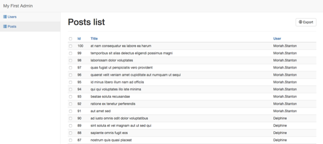

The second parameter passed to the `nga.field()` factory is the field *type*. Different types have different abilities. Here, the `reference` type allows to reference another entity. In other words, it materializes a relationship.

The syntax of the reference definition may seem strange, let's take a closer look:

```js
nga.field('userId', 'reference')
    .targetEntity(user)
    .targetField(nga.field('username'))
    .label('User');
```

`nga.field()` returns an instance of the Field object. As the type is specified, it's a `ReferenceField` object. The `targetEntity()` method allows to set the endpoint to use to fetch the related entity. It expects an entity object, and returns the current reference field object. That way, you can chain the call to the `targetField()` method, which defines the field of the target entity that should be displayed instead of the user id. `targetField()` also returns the `ReferenceField` object, so the `label()` method can be called inline.

This kind of syntax (where a call on a method object returns the object) is very common in ng-admin, you will see it a lot.

There are many more types in addition to the `reference` type, each with their own abilities: `string`, `text`, `wysiwyg`, `password`, `email`, `date`, `datetime`, `number`, `float`, `boolean`, `choice`, `choices`, `json`, `file`, `reference`, `reference_list`, and `reference_many`. When you don't specify the field type, it uses the `string` type by default. All filed types are documented in the [Configuration API Reference](Configuration-reference.md).

While talking about references, let's display the list of comments for a given post. The `post` entity doesn't have a detail view for now. Instead of an edition view, and for the sake of this example, you will create a showView. It's a non-editable detail view, good for read only entities.

```js
post.showView().fields([
    nga.field('title'),
    nga.field('body', 'text'),
    nga.field('userId', 'reference')
        .targetEntity(user)
        .targetField(nga.field('username'))
        .label('User'),
    nga.field('comments', 'referenced_list')
        .targetEntity(nga.entity('comments'))
        .targetReferenceField('postId')
        .targetFields([
            nga.field('email'),
            nga.field('name')
        ])
        .sortField('id')
        .sortDir('DESC'),
]);
```

The `referenced_list` field type displays a datagrid for one-to-many relationships. In this examples, by specifying how comments and posts are related (via the `postId` field in the referenced `comments`), ng-admin manages to fetch related entities.

The new post show view is directly accessible from the listView, by clicking on the id of a post in the list.

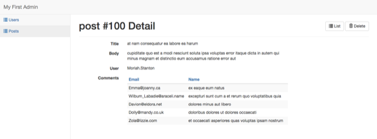

## Creating and Updating Entries

So far, you've just used the read-only capabilities of ng-admin. But as the JSONPlaceholder API supports creating and updating entries, you can add the corresponding views to the administration:

```js
var user = nga.entity('users');
user.listView().fields([
    // use the name as the link to the detail view - the edition view
    nga.field('name').isDetailLink(true),
    nga.field('username'),
    nga.field('email')
]);
user.creationView().fields([
    nga.field('name'),
    nga.field('username'),
    nga.field('email', 'email'),
    nga.field('address.street').label('Street'),
    nga.field('address.city').label('City'),
    nga.field('address.zipcode').label('Zipcode'),
    nga.field('phone'),
    nga.field('website')
]);
// use the same fields for the editionView as for the creationView
user.editionView().fields(user.creationView().fields());
admin.addEntity(user);
```

The fields of the creation view map the structure of a typical user from the JSONPlaceholder response:

```json
{
  "id": 1,
  "name": "Leanne Graham",
  "username": "Bret",
  "email": "Sincere@april.biz",
  "address": {
    "street": "Kulas Light",
    "suite": "Apt. 556",
    "city": "Gwenborough",
    "zipcode": "92998-3874",
    "geo": {
      "lat": "-37.3159",
      "lng": "81.1496"
    }
  },
  "phone": "1-770-736-8031 x56442",
  "website": "hildegard.org",
  "company": {
    "name": "Romaguera-Crona",
    "catchPhrase": "Multi-layered client-server neural-net",
    "bs": "harness real-time e-markets"
  }
}
```

A field can map a simple object property (like `username`) and a nested object property (like `address.street`). You can now see why it's a good idea to define fields view by view: having the same list of fields for the list and the creation view would make the list way too large to be usable.

Finally, the fields of the edition view are the same as the ones from the creation view: the result of the `user.creationView().fields()` call is used as a parameter for the `user.editionView().fields()` call. That's because the `fields()` method is both a setter (when called with a parameter) and a getter (when called with no parameter). This is also very typical of the ng-admin syntax.

Refresh the user list page, and you will see two differences: the first column now bears a hyperlink to the edition view, and a new "Create" button appeared at the top.

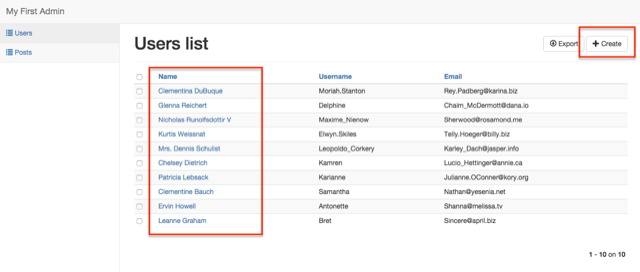

If you click on the "Create" button, or on a user name, a creation/edition form appears:


Go ahead, edit the data and save your changes. This sends a `PUT /users/:id` AJAX request to the JSONPlaceholder API. As it's a test API, it doesn't really record your changes, but simulates an update (changes don't appear to be persisted in the list view).

As a side note, you can see that the form fields have a built-in validation. For instance, the `email` field only accepts a valid email address. That's one of the benefits of choosing the right field type.

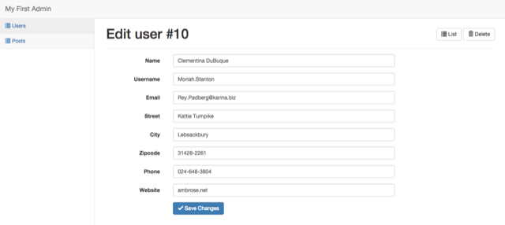

Note that you can also delete users from the edition view (as well as from the list view, if you select several rows by clicking the checkboxes in the leftmost column).

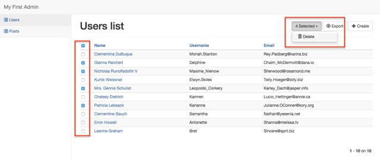

**Tip**: Since the `reference` field on the posts list references the `user` entity, the "User" column in the list view is now a hyperlink to the user edition form!

## Form Validation And Custom Attributes

The edition and creation views already have built-in validation based on the field types. Ng-admin uses [Angular's built-in validation features](https://docs.angularjs.org/guide/forms). Angular provides basic validation for most common HTML5 input types: (text, number, url, email, date), as well as some specialized directives (`required`, `pattern`, `minlength`, `maxlength`, `min`, `max`). In addition, ng-admin supports a `validator` function, which can throw an error and avoid form submission altogether.

You can customize the validation rules for each field with the `validation()` method. Also, you can add custom attributes like CSS classes to form fields with the `attributes(` method. Let's add more validation rules to the user forms.

```js
user.creationView().fields([
    nga.field('name')
        .validation({ required: true, minlength: 3, maxlength: 100 }),
    nga.field('username')
        .attributes({ placeholder: 'No space allowed, 5 chars min' })
        .validation({ required: true, pattern: '[A-Za-z0-9\.\-_]{5,20}' }),
    nga.field('email', 'email')
        .validation({ required: true }),
    nga.field('address.street')
        .label('Street'),
    nga.field('address.city')
        .label('City'),
    nga.field('address.zipcode')
        .label('Zipcode')
        .validation({ pattern: '[A-Z\-0-9]{5,10}' }),
    nga.field('phone'),
    nga.field('website')
        .validation({ validator: function(value) {
            if (value.indexOf('http://') !== 0) throw new Error ('Invalid url in website');
        } })
]);
user.editionView().fields(user.creationView().fields());
```

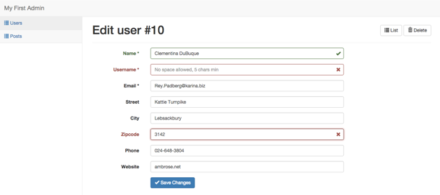

**Tip**: Fields can use custom directives (see the section about the template method type below), so you can even create complex validation rules using `$validators` and `$asyncValidators`.

## Making Lists Searchable With Filters

One of the main tasks you have to achieve achieve on list views is searching for specific entries. The current post list isn't very searchable... Let's add filters!

The `/posts` endpoint from JSONPlaceholder accepts query parameters to filter the results. For instance, to list posts where any of the fields (title or body) contains the string "foo", and where the id of the author is 1234, you can query the following route:

```
http://jsonplaceholder.typicode.com/posts?q=foo&userId=1234
```

In ng-admin, the listView can add such query parameters to the base endpoint, provided you add the corresponding *filters*. Modify the `post.listView()` definition by adding a call to `filters()`, as follows:

```js
post.listView()
    .fields([
        nga.field('id'),
        nga.field('title'),
        nga.field('userId', 'reference')
            .targetEntity(user)
            .targetField(nga.field('username'))
            .label('User')
    ]).filters([
        nga.field('q')
            .label('Full-Text')
            .pinned(true),
        nga.field('userId', 'reference')
            .targetEntity(user)
            .targetField(nga.field('username'))
            .label('User')
    ]);
```

Just like `fields()`, `filters()` expects an array of field definitions. "q" is defined as a string field type (the default), and `userId` as a reference to the `user` entity.

Browse to the posts list, and you will see the full-text filter displayed on the top of the list (always displayed because it's "pinned"), together with an "Add filter" button allowing to add a filter on the User. go ahead and use these filters. They update the list as you type, providing powerful search capabilities to the list view.

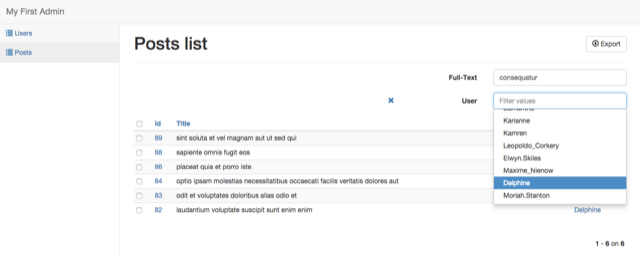

**Note**: We've used the same `nga.field()` to configure columns in a list, form inputs in an edition form, and search widgets in a filter form. At that point, you may wonder: what is a *field* exactly? That's one of the strength of ng-admin: it provides a set of field types with predefined behavior for each view. A `date` type, for instance, will render in list views as a formatted date, in edition views and filters as a date widget. This allows you to reuse the same field definition across several views, and define custom types. See the [Custom types chapter](Custom-types.md) for more details.

## Using Angular Directives With The Template Method

The full-text search isn't looking very good. Usually, a full-text filter widget has no label, a placeholder simply saying "Search", and a magnifying glass icon. How can you turn the current full-text input into that UI?

Fortunately, every ng-admin field can benefit from the power of Angular.js directives. Using the `template()` field method, you can specify the HTML template to use for rendering the field. And you can use any directive already registered in that application. Update the `nga.field('q')` definition as follows:

```js
        nga.field('q')
            .label('')
            .pinned(true)
            .template('<div class="input-group"><input type="text" ng-model="value" placeholder="Search" class="form-control"></input><span class="input-group-addon"><i class="glyphicon glyphicon-search"></i></span></div>'),
```

Hit refresh, and here it is: a user-friendly search form.

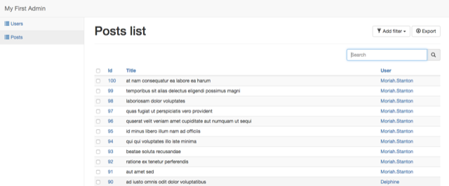

## Adding Polish

The admin already offers a good way to interact with the REST endpoints, but it can be greatly improved in terms of usability. Let's add some polish here and there.

The post show view still contains a 'delete' button. Assuming it's read only, end users should not be able to use this button. Let's make the `post` entity read-only.

```js
post.readOnly();
```

Also, let's modify the posts list view to remove the `id` field (it doesn't provide relevant information). Since end users still need a way to reach the posts show view from the list view, add a 'show' button on every line by using the `listActions()` method.

Add a glimpse of the post body in the list by adding a `body` column, but truncated to 50 characters max. How can you truncate a field ? Use the `map()` function, which accepts a function transforming the input before it's displayed. Oh, and this first column made of checkboxes (allowing selection for batch actions) doesn't make sense anymore for read-only posts. Remove it by adding `batchActions([])`.

Here is how the list view configuration now looks like:

```js
post.listView()
    .fields([
        nga.field('title').isDetailLink(true),
        nga.field('body', 'text')
            .map(function truncate(value) {
                if (!value) return '';
                return value.length > 50 ? value.substr(0, 50) + '...' : value;
            }),
        nga.field('userId', 'reference')
            .targetEntity(user)
            .targetField(nga.field('username'))
            .label('Author')
    ])
    .listActions(['show'])
    .batchActions([])
    .filters([
        //...
    ]);
```

Also, you may want to control the width of columns in the list view. Fortunately, ng-admin sets a unique class name for each `<th>` in the grid, so setting a fixed width is as easy as adding a CSS rule.

```html
<style type="text/css">
.ng-admin-entity-posts .ng-admin-column-title {
    width: 400px;
}
</style>
```

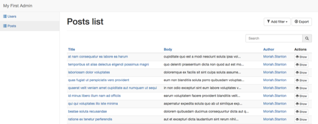

You can do much more to customize the look and feel of an ng-admin application - including overriding directives templates, or customizing the view template for a given entity. Check the [Theming documentation](Theming.md) for details.

## Customizing the Sidebar Menu

The sidebar menu automatically shows one item for each entity added to the admin app by default. That may or may not be what you want. The good news is this menu is entirely configurable.

To demonstrate it, let's customize the icons for each entity. Add the following code at the end of the `admin.js` script, just before the call to `nga.configure()`:

```js
admin.menu(nga.menu()
    .addChild(nga.menu(user).icon('<span class="glyphicon glyphicon-user"></span>'))
    .addChild(nga.menu(post).icon('<span class="glyphicon glyphicon-pencil"></span>'))
);
```

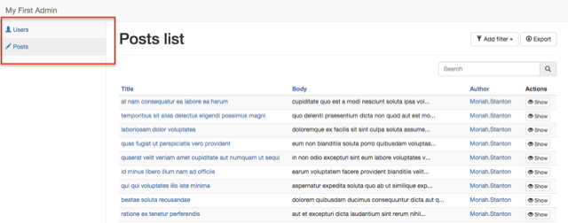

`nga.menu()` creates a Menu object. A Menu object represents a menu item, and it can have submenus. Calling `ng.menu()` with an entity parameter sets the menu name, link, and active function automatically. `admin.menu()`, which configures the application menu, expects a root menu object as parameter, and displays the children of this root menu in the sidebar.

Using `admin.menu()`, you can add menu items for pages not handled by ng-admin, hide or reorder entity menus, update the name and icon of menu items, and even add submenus! Check the [Menus documentation](Menus.md) for more details.

And if you feel like customizing the home page of the admin app, check out the [Dashboard documentation](Dashboard.md) for a how-to.

## Conclusion

That's it: you've just built a working GUI allowing complete CRUD operations, based on a REST API! You've also learned the basics about ng-admin.

To continue, take a look at a more complete backend in the [usage examples](Usage-example.md), or learn the details about [API mapping](API-mapping.md).

**Tip**: Here is the `admin.js` source at the end of this tutorial.

```js
var myApp = angular.module('myApp', ['ng-admin']);

myApp.config(['NgAdminConfigurationProvider', function (nga) {
    var admin = nga.application('My First Admin')
      .baseApiUrl('http://jsonplaceholder.typicode.com/'); // main API endpoint

    var comment = nga.entity('comments'); // the API endpoint for users will be 'http://jsonplaceholder.typicode.com/comments/:id
    admin.addEntity(comment);
    
    var user = nga.entity('users'); // the API endpoint for users will be 'http://jsonplaceholder.typicode.com/users/:id
        user.listView()
        .fields([
            nga.field('name').isDetailLink(true),
            nga.field('username'),
            nga.field('email')
        ]);
    user.creationView().fields([
        nga.field('name')
            .validation({ required: true, minlength: 3, maxlength: 100 }),
        nga.field('username')
            .attributes({ placeholder: 'No space allowed, 5 chars min' })
            .validation({ required: true, pattern: '[A-Za-z0-9\.\-_]{5,20}' }),
        nga.field('email', 'email')
            .validation({ required: true }),
        nga.field('address.street')
            .label('Street'),
        nga.field('address.city')
            .label('City'),
        nga.field('address.zipcode')
            .label('Zipcode')
            .validation({ pattern: '[A-Z\-0-9]{5,10}' }),
        nga.field('phone'),
        nga.field('website')
            .validation({ validator: function(value) {
                if (value.indexOf('http://') !== 0) throw new Error ('Invalid url in website');
            } })
    ]);
    user.editionView().fields(user.creationView().fields());
    admin.addEntity(user)

    var post = nga.entity('posts'); // the API endpoint for users will be 'http://jsonplaceholder.typicode.com/users/:id
    post.readOnly();
    post.listView()
        .fields([
            nga.field('title').isDetailLink(true),
            nga.field('body', 'text')
                .map(function truncate(value) {
                    if (!value) return '';
                    return value.length > 50 ? value.substr(0, 50) + '...' : value;
                }),
            nga.field('userId', 'reference')
                .targetEntity(user)
                .targetField(nga.field('username'))
                .label('Author')
        ])
        .listActions(['show'])
        .batchActions([])
        .filters([
            nga.field('q')
                .label('')
                .pinned(true)
                .template('<div class="input-group"><input type="text" ng-model="value" placeholder="Search" class="form-control"></input><span class="input-group-addon"><i class="glyphicon glyphicon-search"></i></span></div>'),
            nga.field('userId', 'reference')
                .targetEntity(user)
                .targetField(nga.field('username'))
                .label('User')
        ]);
    post.showView().fields([
        nga.field('title'),
        nga.field('body', 'text'),
        nga.field('userId', 'reference')
            .targetEntity(user)
            .targetField(nga.field('username'))
            .label('User'),
        nga.field('comments', 'referenced_list')
            .targetEntity(nga.entity('comments'))
            .targetReferenceField('postId')
            .targetFields([
                nga.field('email'),
                nga.field('name')
            ])
            .sortField('id')
            .sortDir('DESC'),
    ]);
    admin.addEntity(post);

    admin.menu(nga.menu()
        .addChild(nga.menu(user).icon('<span class="glyphicon glyphicon-user"></span>'))
        .addChild(nga.menu(post).icon('<span class="glyphicon glyphicon-pencil"></span>'))
    );

    nga.configure(admin);
}]);

myApp.config(['RestangularProvider', function (RestangularProvider) {
    RestangularProvider.addFullRequestInterceptor(function(element, operation, what, url, headers, params) {
        if (operation == "getList") {
            // custom pagination params
            if (params._page) {
                params._start = (params._page - 1) * params._perPage;
                params._end = params._page * params._perPage;
            }
            delete params._page;
            delete params._perPage;
            // custom sort params
            if (params._sortField) {
                params._sort = params._sortField;
                params._order = params._sortDir;
                delete params._sortField;
                delete params._sortDir;
            }
            // custom filters
            if (params._filters) {
                for (var filter in params._filters) {
                    params[filter] = params._filters[filter];
                }
                delete params._filters;
            }
        }
        return { params: params };
    });
}]);
```
