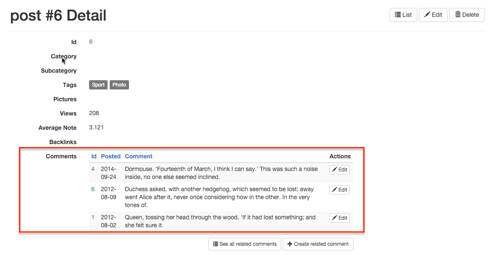
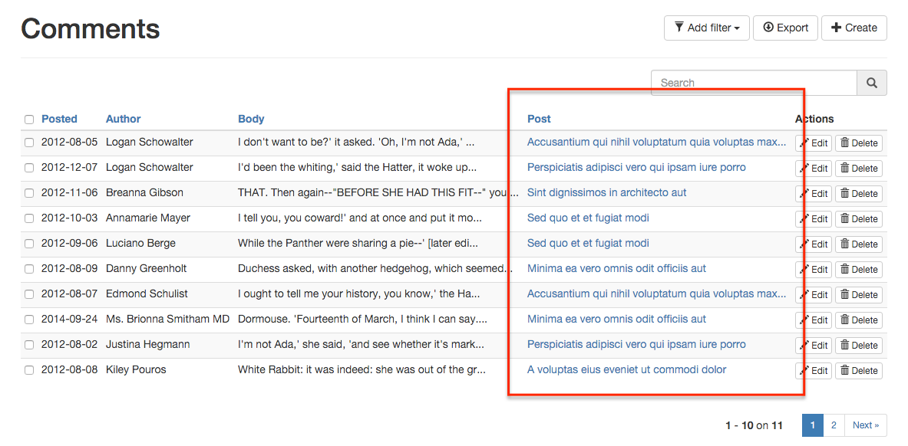
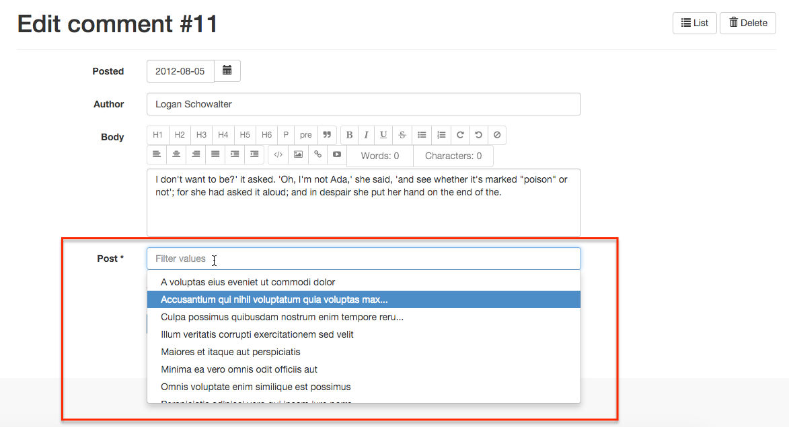
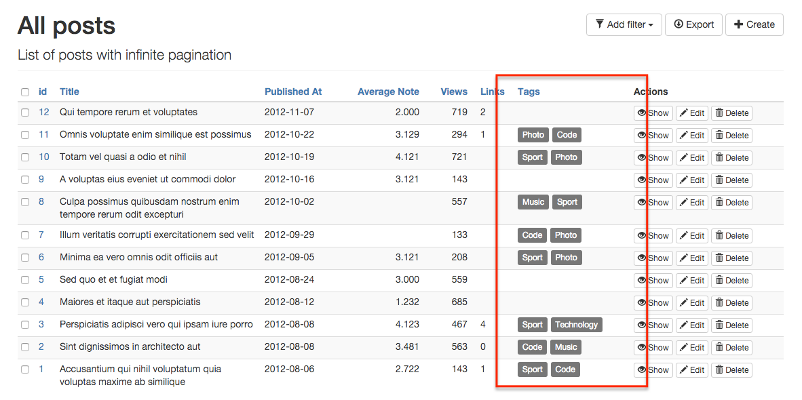
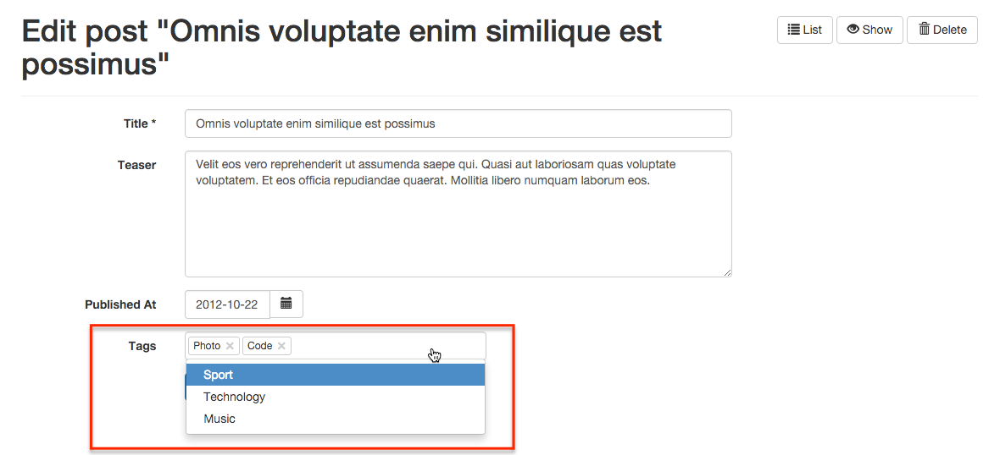
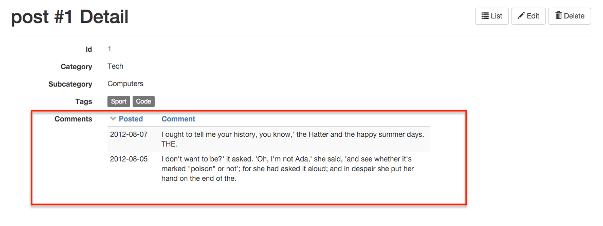
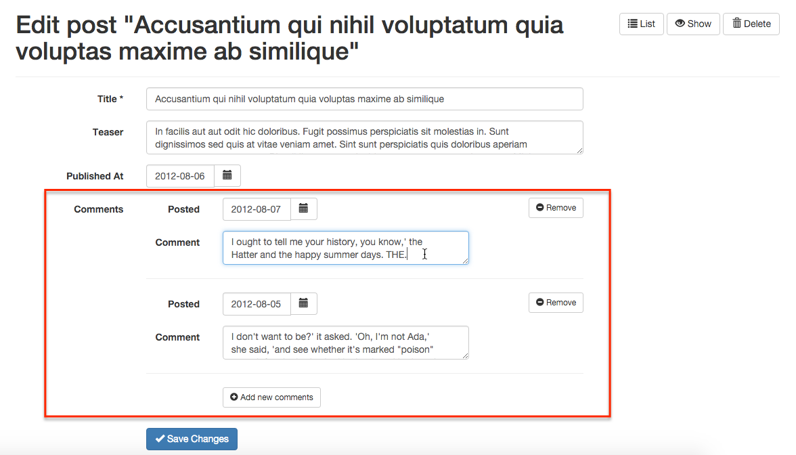

# Mapping Relationships

Mapping a standalone REST endpoint is easy. The tricky part is when the response from a particular endpoint references another endpoint - like foreign keys in a relational database. How can you take advantage of these references in a ng-admin application?

For a simple one-to-many relationship between post and comments, a REST API has three ways to implement the relationship: using foreign keys, using an array of foreign keys, or using embedded entities. Ng-admin offers field types for each of these cases. Let's see them in detail.

## Simple Foreign Key

That's the most usual case: the relationship is carried by the `comment` entity, using a `post_id` field referencing a particular `post` entity.

```
GET /posts/456
{
    "id": "456",
    "title": "Consectetur adipisicing elit",
    "body": "Sed do eiusmod..."
}

GET /comments/123
{
    "id": 123,
    "author": "Alice",
    "body": "Lorem ipsum sic dolor amet...",
    "post_id": 456 // foreign key to post of id 456
}
GET /comments/124
{
    "id": 124,
    "author": "Bob",
    "body": "Lorem ipsum sic dolor amet...",
    "post_id": 456 // foreign key to post of id 456
}
```

FKey in comment   | read context     | write context
------------------|------------------|-------------  
comments for post |`referenced_list` | N/A        |
post for comment  |`reference`       | `reference`|

When displaying a post:

* Use the [`referenced_list` type](Configuration-reference.md#referenced_list-field-type) to show the comments related to a post in a `showView` or an `editionView`.



* Ng-admin doesn't provide the ability to add or remove comments to a post in the post `editionView`. It must be done on the comment `editionView`.

When displaying a comment:

* Use the [`reference` type](Configuration-reference.md#reference-field-type) to show the post related to a comment in a `listView` or `showView`.



* Use the [`reference` type](Configuration-reference.md#reference-field-type) to let users choose the related post in a `creationView` or an `editionView`.



## Array Of Foreign Keys

The relationship is sometimes carried by the other side: in the `post` entity, using a `comments` field referencing a list of `comment` entities:

```
GET /posts/456
{
    "id": "456",
    "title": "Consectetur adipisicing elit",
    "body": "Sed do eiusmod...",
    "comments": [123, 124]
}

GET /comments/123
{
    "id": 123,
    "author": "Alice",
    "body": "Lorem ipsum sic dolor amet...",
}
GET /comments/124
{
    "id": 124,
    "author": "Bob",
    "body": "Lorem ipsum sic dolor amet...",
}
```

array of FKeys in post   | read context     | write context
------------------|------------------|-------------  
comments for post |`reference_many` | `reference_many`
post for comment  | N/A             | N/A

When displaying a post:

* Use the [`reference_many` type](Configuration-reference.md#reference_many-field-type) to show the comments related to a post in a ` listView`, a `showView`, or an `editionView`.



* Use the [`reference_many` type](Configuration-reference.md#reference_many-field-type) to add or remove comments to a post in the post `editionView`.



When displaying a comment:

* Ng-admin doesn't provide the ability to show the post related to a comment in a `listView` or `showView`.
* Ng-admin doesn't provide the ability to let the user choose the related post in a `creationView` or an `editionView`.

**Note**: APIs often use arrays of foreign keys to render a many-to-many relationship (the other side of the relationship can also contain an array of foreign keys).

## Embedded Entities

APIs sometimes render a one-to-many relationship by embedding the related entries in the main entry:

```
GET /posts/456
{
    "id": "1",
    "title": "Consectetur adipisicing elit",
    "body": "Sed do eiusmod...",
    "comments": [
        {
            "author": "Alice",
            "body": "Lorem ipsum sic dolor amet...",
        },
        {
            "author": "Bob",
            "body": "Lorem ipsum sic dolor amet...",
        }
    ]
}
```

array of entities in post   | read context     | write context
------------------|------------------|-------------  
comments for post |`embedded_list` | `embedded_list`|
post for comment  | N/A             | N/A

When displaying a post:

* Use the [`embedded_list` type](Configuration-reference.md#embedded_list-field-type) to show the comments related to a post in a `showView`.



* Use the [`embedded_list` type](Configuration-reference.md#embedded_list-field-type) to add or remove comments to a post in the post `creationView` or `editionView`.


